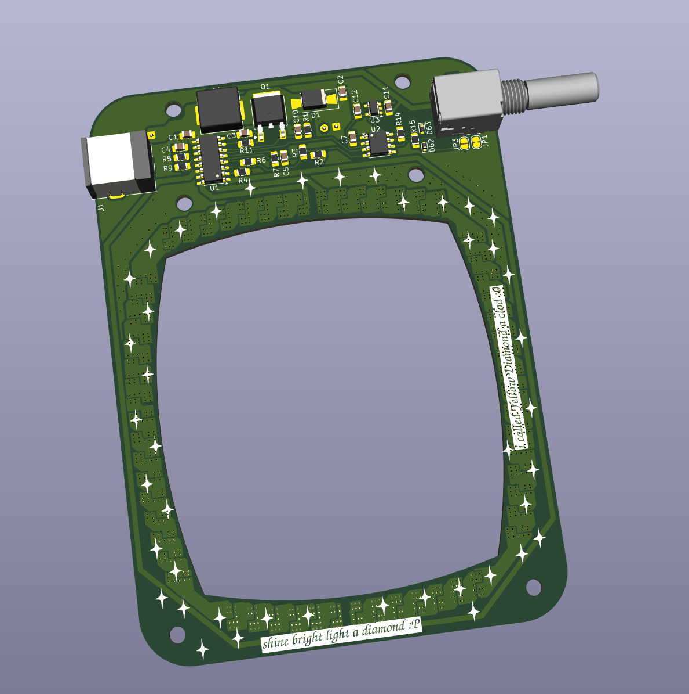
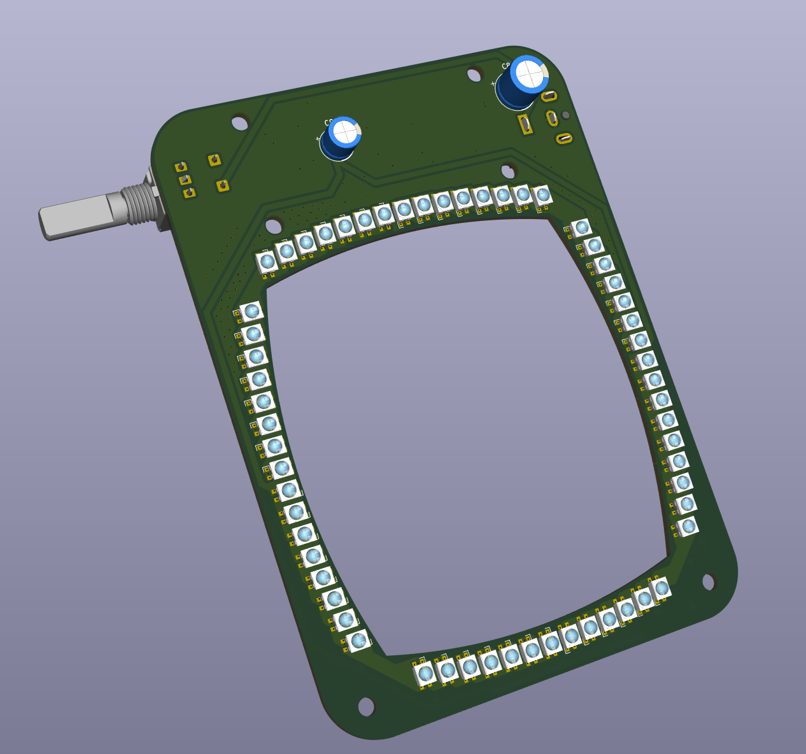

# Donut

A simple ring light designed for a StereoZoom 4 microscope.

## Basic description

A ring light with adjustable brightness (potentiometer knob) driven by a MP3383 LED driver. It has 60 LEDs on them arranged in a circular pattern to give good lighting.

## Images

